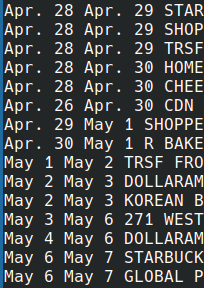
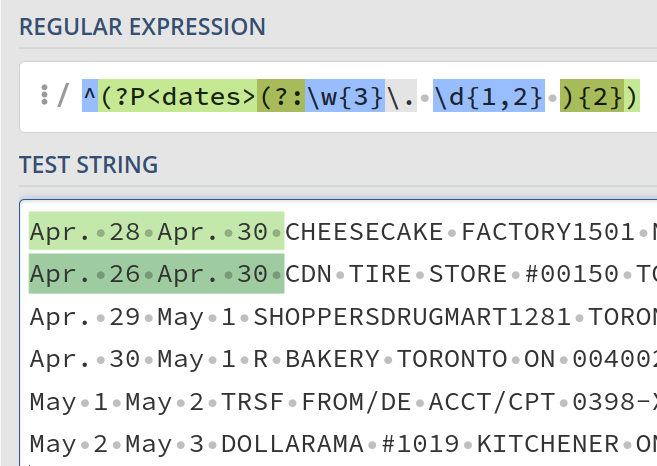
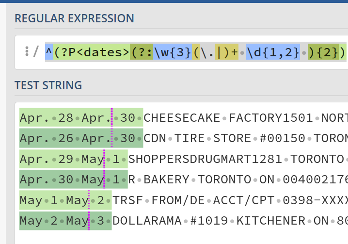
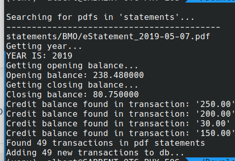
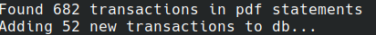

# Teller - Canadian Bank PDF to SQLite/CSV 

Because some FIs don't let you download .csvs for transactions older than 6 months ago because ???, this abomination of a tool exists.

tl;dr - this parses PDFs with pdfplumber into text, then runs a bunch of regex on it to capture transactions with some sanity/validation checking to make sure we got all the transactions correct.

## Features of this fork
- Removed unneeded dependencies (The original repo actually only used PDFPlumber to parse, not sure why there was tabular left in there)
- Removed support for savings/chequing accounts (you shouldn't be spending out of a chequing account anyway, should be for bill payments only)
- Remove dependency on PDF filename for dates
- Move regex into a centralized dictionary to more easily support other FIs
- Add regex for credit balance on credit cards
- Added statements for easy debugging
- Fix validator function so it makes sense for credit cards
- Add duplicate transaction manual override, as the original author incorrectly assumed that same description, date and amounts were invalid
- Store dates in YYYY-MM-DD for easily CSV import to Firefly III 
- Verified FI list:
	- [x] BMO MC
	- [x] TD Visa
	- [x] Manulife Visa
	- [x] RBC Visa/MC
	- [x] AMEX

## Future
- Use more efficient regex, maybe 1 for all FIs but I'm lazy
- Detect account type from statements instead of relying on directory structure
- Docker support for ETL directly into CSV/Firefly III (although efforts are better spent on automated headless selenium .csv interval fetch)
	- You would probably only use this tool once to get your old transactions out of PDFs since some banks stop offering .csvs past the recent 3-6 month window

## How to use

- Clone this repo
- Use a venv

```
# macOS/linux
python3 -m venv venv
source venv/bin/activate

# windows
python3 -m venv venv
source venv/Scripts/activate
```

- Install dependencies
```
(venv) pip install -r requirements.txt
```
- Download all your e-statements (v boring)

- Put the downloaded pdfs into the `statements/TD`, `statements/BMO`, `statements/RBC` directories depending on what FI the statements are for.

```
statements
├── TD
|	└── XXXXXXXXX-2020May25-2020Jun25.pdf
|   ...
├── RBC
|	└── XXXXXXXXX-2020May25-2020Jun25.pdf
|   ...
└── BMO
    └── XXXXXXXXX-2020May12-2020Jun10.pdf
    ...
```
- Statement names don't matter, thanks to another fork we parse the PDF for the date
- Set `TARGET_FI` to your directory name, ex. `TARGET_FI = 'BMO'`
- Run it!

```
(venv) python teller.py -d statements teller.db
```

If you put the statements somewhere else, specify the path to their parent directory with the `-d` option. 

`teller.db`, a [sqlite3](https://www.sqlite.org/index.html) database file, will contain all the transaction data. You can just leave the data there, and later add new statements and rerun with the same .db file - the tool will manage uniqueness of transactions in the database (duplicate files are fine). I recommend rerunning later with only new statements to save time.

You can use the sqlite3 CLI to run queries, but I recommend using [DB Browser for SQLite](https://sqlitebrowser.org).

Now you can have fun running queries and feeling bad about your spending habits. For example:

```
SELECT sum(amount) FROM transactions WHERE description LIKE '%Dunbar Sushi%'
```

## Debugging errors

If you see:

```
Error for statements/BMO/eStatement_2019-05-07.pdf
Discrepancy found, bad parse :(
```
This means that there are missing transactions not picked up by the regex because the math of starting balance minus the closing balance is not the net amount.

The transaction regex is 3 parts because a transaction has 3 data points. The item in the regex array is named `txn`.  

The regex is inbetween the `"`'s, and this is what you put in the simulators.
```python
# date
r"^(?P<dates>(?:\w{3}(\.|)+ \d{1,2} ){2})"

# description
r"(?P<description>.+)\s"

# amount
r"(?P<amount>-?[\d,]+\.\d{2})(?P<cr>(\-|\s?CR))?"
```

1. Turn on debug mode in `teller/pdf_processor.py` by setting `debug = True`  
2. Run it again just on the error statement by moving the other statements out of the dir or into a sub dir  
3. Inspect the transactions displayed  



As you can see, the dates are different so it's probably the date regex.



This confirms that it is the date regex.



After fixing the regex, we can see we can capture the dates again.



Turn off the debug flag and re-run. As you can see, it works perfect now.

Please note that you don't need to delete the .db file and recreate it. It will append new transcations automatically.


Unfortunately, we can never have 100% correct bank statement regex since the bank changes it's formats slightly between statements.
Not sure if its intentional or not, but it's very annoying.

For data browsing sanity checks, I recommend sqlitebrowser: https://sqlitebrowser.org/


## To add FI support yourself
1. Add a bank name to AccountType in `teller/model.py`, ex. BNS (Scotiabank ticker)
2. Set the `debug` flag to `True` in `teller/pdf_processor.py`
3. Create the corresponding dir in `statements/BNS`
4. Drop BNS CC statements in there
5. Create a new dict entry in the `regexes` dict in `teller/pdf_processor.py`
6. Copy paste one of the existing regexes, we will tweak it later 
7. Run it 
8. Copy the output and grab the parts we care about (opening balance, closing balance, statement date range and transactions) - *be careful not to paste your address/CC number into the simulator*
9. Put it into a regex simulator like https://regex101.com/ or https://regexr.com/ or use the regex feature on your text editor
10. Test every regex, modify until it grabs what we need
11. Update the regex inside your new dict entry at `regexes['BNS']`
12. Turn off `debug` flag in `teller/pdf_processor.py`, set to `False`
13. Run it again, if it fails repeat step 9-11 until it works

It shouldn't take long, it took me 5 minutes to add AMEX support once I got the workflow down.